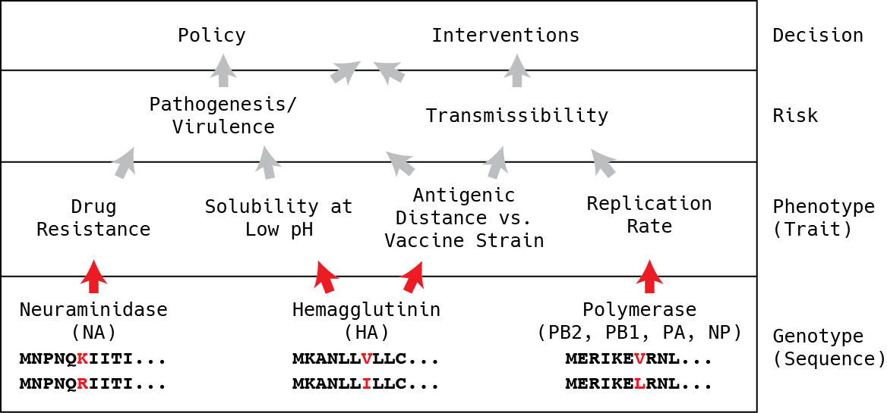

## Research Statement

**Long-term research goals:** My long-term research interests are to build the necessary experimental and computational infrastructure required to make real-time pathogen surveillance, prevention and treatment a *rationally predictive endeavour*. The core problems I have identified are: (a) the paucity of biochemical phenotype data that inform mechanistic knowledge of risk and pathogenesis, and (b) interpretable models to map from sequence data to quantitative measures of pathogen risk.

**Research background:** My research background, which has included both experimental and computational components, has provided me with an excellent set of tools with which to tackle this problem. My experimental training was in synthetic biology, where I spearheaded the formation of the 2009 UBC iGEM team. We built an analog threshold sensor in *E. coli* (named the "Traffic Light Sensor")[^traffic], winning a Gold medal standing with the team in our first year of competing. My contributions included sourcing $6000 in student stipends, designing and executing experiments with my teammates, and delivering our final presentation at the iGEM Jamboree. I also served as an advisor to the 2010 UBC and 2011 UCSF iGEM teams.

[^traffic]: http://2009.igem.org/Team:British_Columbia

I later switched into computational research under Prof. Jonathan A. Runstadler. My first area of focus under has been on influenza disease ecology. Together with my colleagues in the Runstadler lab, we have investigated the role of reticulate evolutionary processes in influenza virus host switching and seasonal persistence [@Ma:2016ht; @Hill:2016dh], and have won poster presentation awards (CEHS 2014, Broad Retreat 2015) based on this work. My contribution here was developing a heuristic algorithm that enabled us to (1) identify reticulate evolutionary events at scale while accurately approximating phylogenetic relationships, and (2) quantitatively measure the importance of reticulate evolutionary processes in ecological niche switches (Figure {@fig:reticulate}).

The second (and more recent) focus is on the prediction of viral phenotype from genotype, otherwise known as phenotypic interpretation of genomic data. The latter is where my current efforts are focused, and have been enabled through collaboration with Prof. David Duvenaud (U Toronto) and through the Broad *Next10* program. We have observed that single point mutations in a viral protein are sometimes necessary but not always sufficient for accurately predicting quantitative protein phenotypes. To solve this problem, we have identified the following needs:

1. Systematically measured paired genotype-phenotype data with modelled uncertainty in measurements.
1. Machine learning algorithms capable of explicitly modelling interactions between amino acid positions.

A key contribution that we expect to emerge from this work is a gold-standard template for predicting viral risk from sequence; **this area of focus is the centrepiece of this Broad Fellows application**.

Apart from these two main areas of focus, I have also collaborated with colleagues in the use of Bayesian phylogenetic methods to study influenza movement and reassortment in wild animals [@Bahl:2016efa; @Bui:2015bja], and performing statistical analysis methods of viral phenotype data [@Hussein:2016cj; @Hussein:2016dc].

### Broad Fellows Vision

A goal of viral genomic surveillance is to help guide appropriate interventions, given sequence data (Figure @fig:surveillance). Risk determination is a necessary step. Health risk is partially determined by a host's response to infection, and partially determined by a virus' biochemical phenotypes. Virus biochemistry is, in turn, determined by its proteins' sequence. While there are numerous studies describing the biochemical and physiological characterizations virus mutants, rational risk determination based on sequence remains elusive, and experiments with conflicting effects cannot be easily compared, because of non-standardized controls and measurement metrics. *As a field, genomic surveillance groups lack the capability to accurately predict phenotype from genotype.*

**At its essence, I see this phenotypic interpretation issue as essentially a machine learning problem that lacks data.** Hence, as a Broad Fellow, I aim to develop an integrated experimental and computational platform for phenotypic interpretation of viral genome sequences. My goals are two-fold: (a) to be able to rapidly phenotype a virus while minimizing experimentation on its live form, and (b) develop interpretable machine learning algorithms that predict phenotype from sequence. In the long-run, I envision this being incorporated into a real-time risk profiling dashboard, usable by epidemiologists, physicians and policy-makers alike. In pursuit of these goals, I plan to develop 2 main project thrusts, which I will elaborate on below.

### Project Thrust 1: Develop scalable, safe and standardized assays for phenotyping viruses.

***Core problems:*** The next frontier in real-time pathogen surveillance is to deduce the risk profile of a virus from its sequence. Doing so can help rationally guide medical and epidemiological decision-making in the event of new outbreaks. It is possible now to sequence a new pathogen within 24 hours of isolation [@Quick:2016kf], and the technology enabling this is being rapidly improved [@Loman:2015dx; @Jain:2015ij; @Sovic:2016bn; @Quick:2016kf; @Quick:2015ko]. However, the state-of-the-art in phenotypic interpretation remains limited to the identification of single amino acid substitutions that are experimentally correlated with (on an ad-hoc basis) some "risky" phenotype (e.g. influenza polymerase replication rate [@Song:2014bu; @Jagger:2010cj; @Li:2009fk; @Hussein:2016dc] and neuraminidase drug resistance [@Paradis:2015bh]).

Amongst the cited studies above, it is evident that there are conflicting effects for so-called "famous" mutations. For example, E627K in the influenza PB2 protein has been described as being an attenuator [@Jagger:2010cj] and activator [@Hussein:2016dc] of replication and pathogenicity, depending on the background genotype and experiment. Moreover, the absence of E627K can be compensated by mutations at other amino acid positions [@Song:2014bu]. As another example, the fitness effects of neuraminidase I223 mutations have been described as neutral [@Pizzorno:2012er] and disadvantageous [@Paradis:2015bh], again depending on the genetic background of the virus. Systematic and standardized measurements across all known viral protein genotypes are needed to disentangle these seemingly conflicting results. It is clear that the missing link is a systematically measured and standardized phenotype dataset paired with sequence information. New developments are needed to make real-time phenotypic interpretation a reality.

***Proposed work:*** In the first project thrust, I will systematically measure influenza virus protein variants and their epidemiologically-relevant phenotypes. I will begin with the influenza neuraminidase, which has the signatures of low-hanging fruit:

1. It is an epidemiologically-relevant phenotype.
1. It can be measured with an established biochemical assay (fluorescence).
1. It is amenable to robotic liquid handling.
1. It has yet to be systematically measured.

In order to generate protein variant libraries, I will use a two-pronged approach. To learn from historical data, I will use DNA assembly and synthesis methods to create a rational library of existing neuraminidase variants in the Influenza Research Database. To pre-emptively explore genotypic space, I will generate random mutants from contemporary neuraminidase variants that have been sampled in the past year, and sequence the variants that exhibit large changes in neuraminidase resistance.

In preliminary work partially supported through the Broad *Next10*, I have developed a Bayesian statistical framework [^bayesian] for analyzing high throughput data, and used it with statistical simulations to empirically determine the number of replicate measurements necessary for accurate phenotyping (Figure @fig:accuracy). This work has informed the design of existing assays in our group. With the data generated, we can use this framework to model the uncertainty associated with the measurements; this uncertainty will be transparently reported, and will be leveraged in Aim 2.

[^bayesian]: https://github.com/ericmjl/bayesian-measurement-paper

I will also characterize the influenza polymerase RNA replication rate using a luciferase-based polymerase assay. The polymerase replication rate is directly related to viral load, and has been implicated in pathogenic phenotypes; it also fulfills the same four criteria outlined for neuraminidase drug resistance. With colleagues in the Blainey lab, we are also currently exploring alternative assays for polymerase replication that can be conducted at a fraction of the cost, funded by the Broad *Next10* program.

As a "stretch goal" within the Broad Fellows timeframe, with my team I will explore the feasibility of leveraging the influenza virus' genetic systems to develop mammalian systems for continuous evolution, inspired by PACE [@Esvelt:2011cv]. This may allow us to pre-emptively explore the influenza genotype space faster than manual random mutagenesis, and may also be leveraged as a tool for evolution of proteins that require mammalian cellular modifications to be functional.

Concurrent with ongoing systematic testing of the influenza polymerase, I will also explore the extension of this phenotyping system to other viruses. In doing so, I aim to develop a modular, plug-and-play phenotyping system for rapidly phenotyping emerging viral outbreaks as they occur. In the long run, the goal is to develop a toolkit of standardized and scaled phenotyping assays for multiple phenotypes across multiple viruses.

The data that my team will generate will have advantages that stand in contrast to the current available data. Firstly, it will be data relevant to understanding the **mechanistic** underpinnings of influenza risk and pathogenesis. This stands in contrast to more easily collectable proxies, such as the number of influenza-like illnesses (ILI) per year and viral load in patient cohorts, both of which are far removed from pathogenesis mechanisms. Understanding the biochemical underpinnings of pathogenesis also opens opportunities for the development of drug treatments. Secondly, the data will be **standardized**, allowing for easier inter-comparison between genotypes. This stands in contrast to the currently available phenotyping data, which are measured ad-hoc and difficult to compare because of the use of non-standard baseline controls. Finally, explicitly measuring uncertainty will improve **transparency**, and including them in machine learning applications will allow for propagation of uncertainty to final predictions.

***Collaborations:*** I anticipate partnering and leveraging the Chemical Biology and Genomics Platforms to accelerate the experiments described above.

***Short-term milestones:*** In the spirit and interest of open science, the protocols and data generated will be released freely through the Broad Institute, available for the research community through a web-based interface. All publications will be deposited on pre-print servers and published in open-access venues.

### Project Thrust 2: Develop and deploy machine learning models that predict quantitative biochemical phenotype from sequence.

***Core problem:*** Over the past two decades, machine learning has been applied to protein sequences and structures to predict properties, such as drug resistance and viral host species [@Wang:2003cg; @Kjaer:2008kc; @Walsh:2015cc; @Prosperi:2009ua; @Hepler:2014fy; @Attaluri:2012uea]. However the state-of-the-art models suffer from a number of issues.

Firstly, there is the trade-off between learning capacity (model complexity) and interpretability; the latter is the biggest limiting factor in deployability in clinical settings. For example, decision trees, which are highly interpretable, are prone to over-fitting and hence have limited generalizability. On the other hand, artificial neural networks (and deep nets) exhibit good generalizability, but are opaque to introspection, and hence suffer from a lack of interpretability.

Secondly, current learning algorithms are unable to accept variable-length sequences as input, which poses a problem for learning tasks on fast-evolving viral proteins that can undergo insertions and deletions, apart from substitutions, as part of their evolutionary trajectory.

Finally, most current off-the-shelf algorithms (e.g. Random Forest) are unable to account for uncertainty associated with measurements, and hence are limited in their ability to produce uncertainty estimates for new predictions. Knowing this uncertainty can, for example, aid in deciding which sequences to triage for deeper phenotyping before making a intervention decisions.

Recent progress in deep learning has led to the development of deep convolutional networks that operate on chemical graphs to predict chemical properties of small molecules [@Duvenaud:2015wwa]. In such graphs, nodes are atoms and edges are bonds. By converting each variable length graph into a fixed length fingerprint, input sequences of variable length (e.g. chemical structures of varying numbers of atoms) can be used as inputs for supervised machine learning. By inspecting the maximally activated nodes and edges, the structural features most predictive of chemical properties (e.g. hydroxyl groups for solubility, sulfonyl groups for toxicity) can also interpretably visualized.

***Proposed work:*** Protein structures are a natural extension of chemical graphs, where nodes are amino acids and edges are biochemical interactions between them. In collaboration with David Duvenaud of the University of Toronto, I am currently developing a software package that converts protein structures into a graph representation [^protein_nets], and a software package that enables general purpose deep learning on graphs [^deepnets]. In a proof-of-principle, I have successfully trained an alpha version of this neural network on HIV-1 protease drug resistance to fosamprenavir (FPV), and used it to identify amino acids clusters that are positively or negatively associated with FPV resistance (Figure @fig:hiv), as well as Bayesian regression models that incorporate modelled uncertainty in predictions.

[^deepnets]: https://github.com/ericmjl/protein-convolutional-nets/
[^protein_nets]: https://github.com/ericmjl/protein-interaction-network/

As a Broad Fellow, I will mature the deep learning algorithm for use with our influenza phenotyping data. The current implementation, which is currently prototyped in pure-Python, will be optimized for speed. I will also use a Bayesian approach to explicitly propagate the uncertainty associated with systematic measurements (Aim 1) to uncertainty in predictions. I will leverage the computational resources that I have access to, including the Broad and BioMicroCenter (MIT) compute clusters, as well as on-demand commercially-available cloud compute capacity (where necessary).

Following this, I will use data generated from Aim 1 as training data for the deep learning models developed here in Aim 2, and use this to generate global and historical predictions of influenza drug resistance and replication rate potential. By training regression models on multiple viral phenotypes, we will gain the capacity to quantitatively map the risk profile of newly emerged viruses. As a long-term goal, I envision that these models, which are trained on data mechanistically relevant to influenza pathogenesis, can form the foundation of hierarchical models of pathogen biology and risk.

***Collaborations:*** I anticipate continuing to collaborate with David Duvenaud as he continues his tenure as a new faculty member at the University of Toronto. Additionally, I expect that this project thrust will open up new computational avenues for Broadies to leverage, either in the form of workshops on machine learning (which I have delivered at the Broad before) or through research collaborations.

***Short-term milestones:*** My team will release the protein interaction network and graph fingerprinting software alongside manuscripts in open access publication avenues. All of the software will be freely available and archived in long-term repositories (e.g. Zenodo) in accordance with open science principles.

## Forecasted Impact

The data and models that I foresee my team developing will be a rich resource for the influenza research community, and as a Broad Fellow, I would welcome data reuse and sharing. Beyond their usefulness for epidemiological purposes (i.e. identifying signatures of a “risky” virus), I envision the phenotyping platform and data becoming useful in a variety of other settings.

One example is in drug repurposing. With the proposed scalable assays developed, I foresee collaborating with other groups at the Broad who are interested in drug repurposing efforts. For example, with our proposed phenotyping system, we may be able to identify existing non-toxic molecules that target multiple components of flu simultaneously, reducing the likelihood of viral drug resistance by opening avenues for combination therapy.

Another example is in drug development. In order to pre-emptively identify viral proteins that exhibit resistance to newly developed drugs, we can create new synthetic protein variants using contemporary strains as the starting sequence. Medicinal chemists may be able to use the phenotyping platform to pre-emptively test new versions of their drugs and validate their effects against the phenotype catalogue.

A third example is in real-time surveillance. The capacity for obtaining accurate sequence within a day of an outbreak is rapidly becoming a reality. Real-time phenotypic interpretation of the viral genome will provide actionable information to clinical care providers and policy-makers.

The final example is in furthering our basic understanding of pathogen evolution. This is a low-hanging fruit which I hope to pursue as soon as we have the data available. By using predictions from our trained deep learning models, we may re-examine historical trends of neuraminidase drug resistance over time, possibly providing greater resolution when compared against the use of H275Y and I223V molecular markers of resistance. We may also combine our predictions with Bayesian phylogenetic modelling to better understand how public health interventions affect the evolutionary trajectory of viral pathogens w.r.t. their epidemiologically relevant phenotypes.

My long-term goal is to make surveillance a holistic and rationally predictive endeavour, and that necessitates open participation by and access for the surveillance community. By publicly releasing this systematically measured pathogen phenotype data (i.e. "The Broad Viral Phenotype Collection"), I believe that this work will positively impact pathogen genomic surveillance efforts by developing the necessary workflow, data and models for rational prediction of risk. I also foresee applications in downstream research, such as drug development.

## Planned Funding Avenues

In order to sustain this work beyond the Broad Fellows period, I will solicit funding from a variety of government and philanthropic sources. Apart from the NIH R21 proposal that I led with my advisor Jon and collaborator David, I foresee this being of interest to the DARPA Prophecy program, NIAID, and companies interested in drug development. Finally, to acquire a continued revenue stream for the research and development work, I will explore the use of funding models through application programming interfaces (APIs) that allow access to value-added data and models, which may be of interest to other academic and commercial entities [@CheckHayden:2016ip; @CheckHayden:2013kb].

---

The full version-control history of this application can be found online [^broad].

[^broad]: https://github.com/ericmjl/broad-research-fellows

## Figures

{#fig:reticulate}

{#fig:surveillance}

{#fig:accuracy}

{#fig:hiv}

## References
