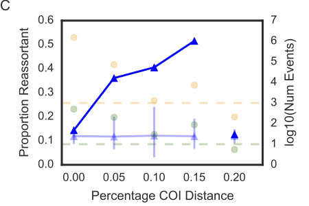

<!--
Comments by Bill:
- Be sure to state what kind of institutional support can be leverage?
- Can add some “logistics overview” - what kind of people, what kind of equipment?
- On the experimental side, can add a bit more detail on the format of the experiments.
- Explain why the Broad is *the* best place to do this work.
- Would this be *in vitro* or *in-cell* models?
- What has been done, what we need to do, how prepared are we for this?
- Ask Paul Blainey & Pardis for a meeting.
-->

## Research Statement

**Long-term research goals:** My long-term research interests are to build the necessary experimental and computational components required to make real-time pathogen surveillance, prevention and treatment a *rationally predictive endeavour*. The core problems I have identified are: (1) the paucity of biochemical phenotype data that inform mechanistic knowledge of risk and pathogenesis, and (2) interpretable models to map from sequence data to quantitative measures of pathogen risk.

**Research background:** My research background, which has included both experimental and computational components, has provided me with an excellent set of tools with which to tackle this problem. My experimental training was in synthetic biology, where I spearheaded formation of the inaugural 2009 UBC iGEM team that built an analog threshold sensor in *E. coli* (named the "Traffic Light Sensor"). I also served as an advisor to the 2010 UBC and 2011 UCSF iGEM teams.

I later switched into computational research under Prof. Jonathan A. Runstadler. My first area of focus under has been on influenza disease ecology. Together with my colleagues in the Runstadler lab, we have investigated the role of reticulate evolutionary processes in influenza virus host switching and seasonal persistence [@Ma:2016ht; @Hill:2016dh], and have won poster presentation awards (Broad Retreat, CEHS) based on this work. A key contribution from this work was developing a heuristic algorithm that enabled us to identify reticulate evolutionary events at scale while accurately approximating  phylogenetic relationships, and quantitatively measuring the importance of reticulate evolutionary processes in ecological niche switches (Figure {@fig:reticulate}).

The second (and more recent) focus is on the prediction of viral phenotype from genotype (i.e. phenotypic interpretation of genomic data). The latter is where my current efforts are focused, and have been enabled through collaboration with David Duvenaud (U Toronto) and through the Broad *Next10* program. We have observed that single point mutations in a viral protein are necessary but not sufficient for accurately predicting quantitative protein phenotypes, and that we need (1) systematically measured paired genotype-phenotype data and (2) machine learning algorithms capable of explicitly modelling interactions between amino acid positions. A key contribution that we expect to emerge from this work is a gold-standard template for predicting viral risk from sequence; this area of focus is the centrepiece of this Broad Fellows application.

Apart from these two main areas of focus, I have also collaborated with colleagues in the use of Bayesian phylogenetic methods to study influenza movement and reassortment in wild animals [@Bahl:2016efa; @Bui:2015bja], and developing analysis methods for viral phenotype data [@Hussein:2016cj; @Hussein:2016dc].

**Broad Fellows vision:** As a Broad Fellow, I aim to develop an integrated experimental and computational platform for phenotypic interpretation of viral genome sequences. The goals are two-fold: (1) to be able to phenotype a virus while minimizing experimentation on its live form, and (2) develop (with collaborators) interpretable machine learning algorithms that predict phenotype from sequence. In the long-run, I envision this being incorporated into a real-time risk profiling dashboard. In pursuit of these goals, I plan to develop 2 main project thrusts, which I will elaborate on below.

### Project Thrust 1: Develop epidemiologically relevant, scalable and rapid methods for experimentally phenotyping viruses.

**Core problems:** One goal of real-time pathogen surveillance is to deduce its risk profile of a virus from its sequence. Doing so can help rationally guide medical and epidemiological decision-making in the event of new outbreaks. The sequencing technologies necessary to power this are rapidly being developed and improved [@Gardy:2015fp; @Quick:2016kf; @Loman:2015dx]. The crucial missing link here are high throughput, experimentally measured phenotype data relevant to epidemiology. In the first project thrust, I aim to work with my team to engineer the technologies to rapidly phenotype influenza viruses polymerase (replication rate), hemagglutinin (viral entry and immune evasion), and neuraminidase (viral release and drug resistance). The two core problems I aim to solve with my team are:

1. The lack of systematically measured phenotype data paired with protein variant sequences.
1. The lack of a catalogue of safe, scalable, and standardized phenotyping assays to rapidly phenotype these proteins.

Proteins are the arbiters of viral function. Hence, I believe that a pathogen’s measure of “riskiness” is composed of its proteins’ biochemical activities. In this paradigm, the rational approach requires making systematic and properly standardized measurements, on epidemiologically relevant biochemcial phenotypes, for libraries of protein variants.

<!-- Emphasize how it can be catalytic. Also should be good to show that we have received funding.
%% Talk with Paul Blainey about it.
 -->

**Proposed work:** We will begin with phenotyping assays that are already amenable to systematic testing but have not yet been executed at scale. One low-hanging fruit is the polymerase minigenome assay, in which the influenza polymerase activity is read out using a luciferase reporter, and is amenable to high throughput liquid handling. In order to generate protein variant libraries, we will use a two-pronged approach. To learn from historical data, we will create a rational library of existing protein variants in the Influenza Research Database. To pre-emptively explore genotypic space, we will generate random mutants from contemporary protein variants that have been sampled in the past year.

As a medium term bet, and concurrent with ongoing systematic testing of the influenza polymerase, we will also explore the extension of this phenotyping system to other viral polymerases. In doing so, we aim to develop a modular, plug-and-play phenotyping system for rapidly phenotyping emerging viral outbreaks as they occur. In the long run, the goal is to develop and scale assays for other phenotypes, such as drug resistance, binding to cellular receptors, and *in vitro* antigenicity measurements using virus-like particles. In other words, multiple phenotypes across multiple viruses.

The data that we will generate as a team will have advantages that stand in contrast to the current available data. Firstly, it will be data relevant to understanding the mechanistic underpinnings of influenza risk and pathogenesis. This stands in contrast to more easily collectable proxies, such as the number of influenza-like illnesses (ILI) per year and viral load in patient cohorts, both of which are far removed from pathogenesis mechanisms. Understanding the biochemical underpinnings of pathogenesis opens opportunities for the development of drug treatments. Secondly, the data will be standardized and done systematically and at scale. This standardization has advantages over existing biochemical phenotype measurements, such as antigenic distance to vaccine strains, hemagglutinin receptor specificity and neuraminidase drug resistance, which have only been measured ad-hoc in response to new infections with non-standardized, merely conveniently available controls, and hence have no global standard of comparison for risk.

<!-- Emphasize those people who are not Jon, so that I can be seen as more independent. Put Paul & Pardis above, and then say that anticipate synchronizing expertise from Jon’s lab. -->

**Potential Collaborations:** I anticipate collaborating with Pardis Sabeti’s group to explore the development of other molecular assays for emerging viruses. I also anticipate collaborating with Paul Blainey’s group to leverage their microfluidics expertise in miniaturizing and automating the biochemical assays.

**Short-term milestones:** In the spirit and interest of open science, the protocols and data generated will be released freely through the Broad Institute, available for the research community through an in-house web-based interface, as well as through open access publications.

### Project Thrust 2: Develop and deploy machine learning models that predict quantitative biochemical phenotype from sequence.

<!-- The main focus here is on predictive use of the data. May want to change the title of this section to focus on prediction, tying it with the -->

Machine learning offers us the capacity to learn the complex mapping from genotype to phenotype. Our second project thrust will take advantage of recent developments in deep learning to bring interpretability and learning capacity to machine learning on protein phenotypes.

**Core problem:** Over the past decade, machine learning has been applied to protein sequences (#cite) and structures (#cite) to predict properties such as drug resistance, but the state-of-the-art models suffer from the trade-off between learning capacity (model complexity) and interpretability, the latter being the biggest limiting factor in deployability in clinical settings. An additional limitation is that they are unable to accept variable-length sequences as input, which poses a problem for fast-evolving viral proteins that can undergo insertions and deletions, apart from substitutions, as part of their evolutionary trajectory.

Recent progress in deep learning has led to the development of convolutional deep networks that operate on chemical graphs to predict chemical properties of small molecules (#cite: David Duvenaud's work). In such graphs, nodes are atoms and edges are bonds. By converting the each variable length graph into a fixed length fingerprint, input sequences of variable length (e.g. chemical structures of varying numbers of atoms) can be used as inputs to supervised learning algorithms. By inspecting the maximally activated nodes and edges, the structural features most predictive of chemical properties (e.g. hydroxyl groups for solubility, sulfonyl groups for toxicity) can also interpretably visualized.

**Proposed work:** Protein structures are a natural extension of chemical graphs, where nodes are amino acids and edges are biochemical interactions between them. In collaboration with David Duvenaud of the Harvard Intelligent and Probabilistic Systems group, I am currently developing software that converts protein structures into a graph representation and a software package that enables general purpose deep learning on graphs. While both are currently unpublished work, I am actively working on these two pieces of software, with code publicly available on GitHub (#link), with considerable performance progress being made.

I will begin with maturing the graph deep learning software for use with our influenza replication phenotyping data; preliminary work on predicting HIV-1 protease drug resistance has shown great promise. The goal here is to identify the deep convolutional network architectures that can most accurately predict quantitative replication phenotype from modelled structure. I will leverage the computational resources that I have access to, including the Broad and BioMicroCenter (MIT) compute clusters, as well as on-demand commercially-available cloud compute capacity (where necessary).

A medium-term goal will be to pair the computational efforts with the diverse experimental data generated to train models for each protein's set of measures phenotypes. For single proteins/complexes with multiple measured phenotypes, I will experiment with multi-task learning, simultaneously learn multiple measured phenotypes for the same sequence.

By training regression models on multiple viral phenotypes, I will gain the capacity to quantitatively map the risk profile of newly emerged viruses. As a long-term goal, I envision that these models, which are trained on mechanistically relevant data, can form the foundation of hierarchical models of pathogen biology and risk.

Beyond the application to viral phenotype prediction, machine learning on graph-structured data is a very new field of research, with only a handful of pre-print manuscripts available this year (#cite arXiv papers). Because of the novelty of this field, we expect to make substantial contributions in the application of deep learning to graph-structured data in general.

<!-- Add collaborations with MIA/Jon Bloom here. Place emphasis on “Leverage one thing here for new things.” -->

**Potential collaborations:** I anticipate continuing to collaborate with David Duvenaud as he begins his tenure as a new faculty member at the University of Toronto. Additionally, this project thrust will open up new computational avenues for Broadies to leverage, for example, by training supervised machine learning tasks on metabolic and genomic interaction networks.

**Short-term milestones:** I will release the protein interaction network and graph fingerprinting software alongside manuscripts in open access publication avenues.

## Forecasted Impact

The data and models that I develop will be a rich resource for the influenza research community, and as a Broad Fellow, I would welcome data reuse and sharing. Beyond their usefulness for epidemiological purposes (i.e. identifying signatures of a “risky” virus), I envision the data becoming useful in a variety of other settings.

One example is in drug repurposing. With the proposed scalable assays developed, I foresee collaborating with other groups at the Broad who are interested in drug repurposing efforts. For example, with our proposed phenotype collection, we may be able to identify existing non-toxic molecules that target multiple components of flu simultaneously, reducing the likelihood of drug resistance by opening avenues for combination therapy.

Another example is in drug development. In order to pre-emptively identify viral proteins that exhibit resistance to newly developed drugs, we can create new synthetic protein variants using contemporary strains as the starting sequence. Medicinal chemists may be able to use this data to pre-emptively test new versions of their drugs and validate their effects against the phenotype catalogue.

The final example is in furthering our basic understanding of pathogen evolution. This is a low-hanging fruit which I hope to pursue as soon as we have the data available. By using our trained deep learning models, we may (re-)examine historical trends of neuraminidase drug resistance or polymerase activity over time. We may also combine our predictions with Bayesian phylogenetic modelling to better understand how public health interventions affect the evolutionary trajectory of viral pathogens w.r.t. their epidemiologically relevant phenotypes.

Our ultimate goal is to make surveillance a holistic and rationally predictive endeavour. I believe that this work will positively impact pathogen genomic surveillance efforts by developing the necessary workflow, data and models for rational prediction of risk. I also foresee downstream research in drug development and pathogen surveillance through the public release of systematically measured pathogen phenotype data (i.e. “The Broad Phenotype Collection”).

## Planned Funding Avenues

In order to sustain this work beyond the Broad Fellows period, I will solicit funding from a variety of government and philantrophic sources. Apart from the NIH R21 proposal that I am co-writing with my advisor Jon and collaborator David, I foresee this being of interest to the DARPA Prophecy program, NIAID, and companies interested in drug development. Finally, to acquire a continued revenue stream for the research and development work, our team will explore the use of funding models for application programming interfaces (APIs) that allow access to value-added data and models, which may be of interest to other academic and commercial entities (#cite: database funding models).

## Figures

{#fig:reticulate}

## References
